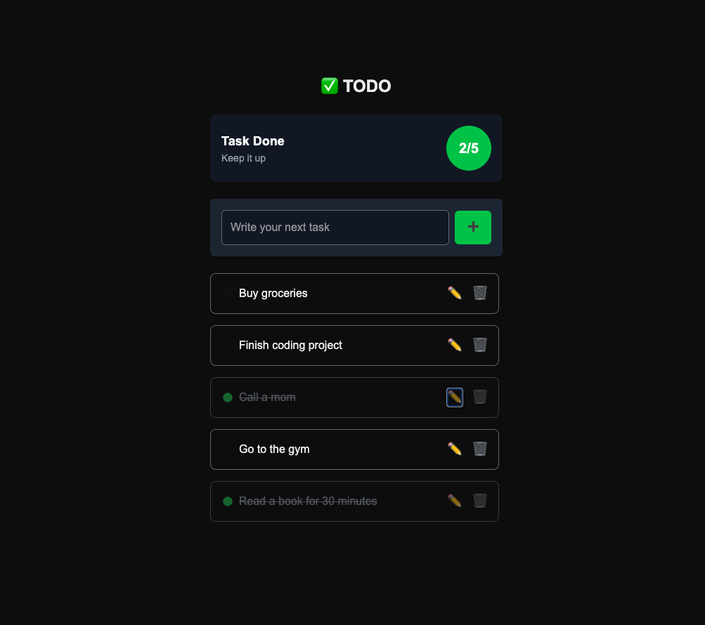

# ✅ Next.js TODO App with Tailwind CSS

A sleek and minimalistic TODO application built using **Next.js** and **Tailwind CSS**. This app allows users to add, mark as completed, edit, and delete tasks. It also features smooth UI updates with success messages.

## ✨ Features
- Add new tasks 📌
- Mark tasks as completed ✅
- Edit tasks 📝
- Delete tasks ❌
- Task counter (completed / total) 📊
- Smooth success messages 💬
- Persistent storage with `localStorage` 💾

## 📸 Screenshot

## 🌐 Live Demo
[View the app on Vercel](https://todo-lake-nine-41.vercel.app/)

